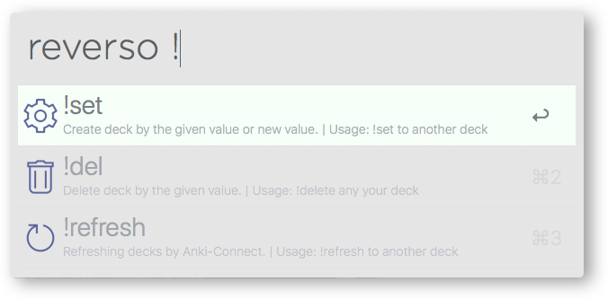

# alfred-reverso [](https://travis-ci.org/bikenik/alfred-reverso)

> [Alfred 3](https://www.alfredapp.com) workflow to quick look from [ContextReverso.net](http://context.reverso.net/translation/) and create flash cards to [Anki](https://apps.ankiweb.net) cards.

#### Search by headword or phrase or by selected text from anywhere.


## Preview

<details>
 
<!-- toc -->

#### Create, choose and delete your decks in Anki


#### Use <kbd>⌘L</kbd> for more info by large text and copy it
![Use [⌘L] for more info by large text and copy it](./media-readme/largeText.png)

<!-- tocstop -->

</details>

#### Try [this](https://github.com/bikenik/alfred-reverso/blob/master/Reverso.apkg) Anki theme (Scramble-sentences) to learning by created cards


## Install

```
$ npm install --global alfred-reverso
```

* Download and import the [deck example](https://github.com/bikenik/alfred-reverso/raw/master/Reverso.apkg) for Anki to install template. [includes two note types]

_Requires: [Node.js](https://nodejs.org) 7.6+, Alfred [Powerpack](https://www.alfredapp.com/powerpack/), [Anki](https://apps.ankiweb.net) intelligent flash cards, [AnkiConnect](https://ankiweb.net/shared/info/2055492159) plugin for Anki._


## Usage

- In Alfred, type `reverso`, <kbd>Enter</kbd>, and your query.
- In Alfred, type `reverso *`, <kbd>Enter</kbd>, and your query to search by your favorite phrases.
- In Alfred, type `reverso !`, <kbd>Enter</kbd>, to setting, choose your deck with Anki or delete some.

1. Make a couple of from your source language (srcContext) and target language (trgContext), guided by [Reverso site](http://context.reverso.net/) in [Alfred workflow configuration](https://www.alfredapp.com/help/workflows/advanced/variables/).

2. To use your favorite sentences (quick look, adding to Anki) create an account on the Reverso and share your favorite list of sentences. Set your username  (userName) in [Alfred workflow configuration](https://www.alfredapp.com/help/workflows/advanced/variables/).

## Configuration

* There is six requirenments: 
  - `note_type`: "ReversoContext" - by default don't need to change. For bunch - Source language => Target language 
  - `note_type_reverse`: "ReversoContext(reverse)" - by default don't need to change. For bunch - Target language => Source language 
	- `path_to_anki-media`: /Library/Application Support/Anki2/< Profile name of Anki >/collection.media.
	- `srcContext`: your Source language (e.g Mother tongue)
	- `trgContext`: your Target language (The language wich you want to learn)
      * "arabic", "german", "english", "spanish", "french", "hebrew", "italian", "japanese", "dutch", "polish", "portuguese", "romanian", "russian"

    not all couples will be work - check with [Reverso site](http://context.reverso.net)
  - `userName`: To use your favorite sentences (quick look, adding to Anki) create an account on the Reverso and share your favorite list of sentences. Set your username. Do not change default value if you aren't want create account.


### ToDo

- [ ] Tests

### By me a coffee

<a href="https://www.buymeacoffee.com/cLMme6h" target="_blank"></a>

## License

MIT © [bikeNik](http://bikenik.org)
